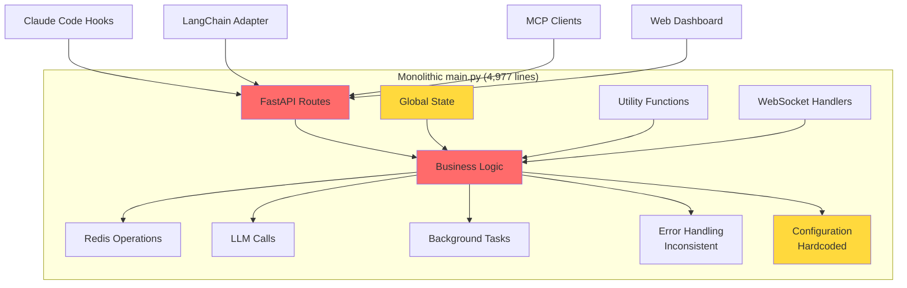
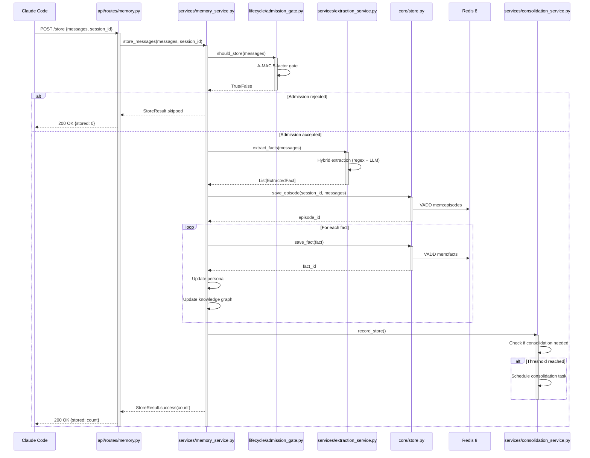
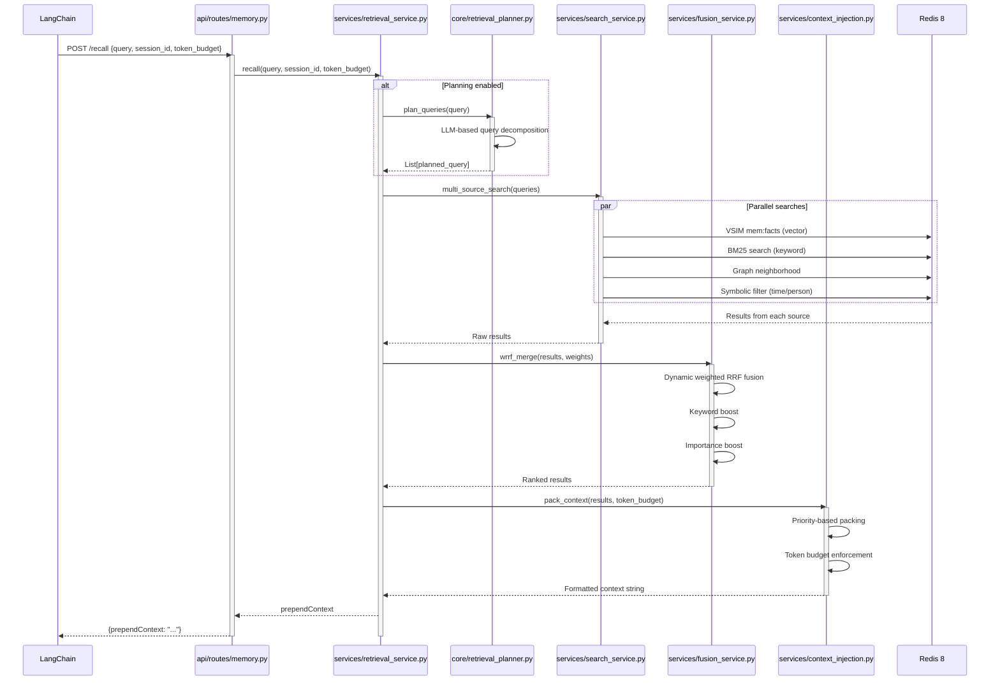
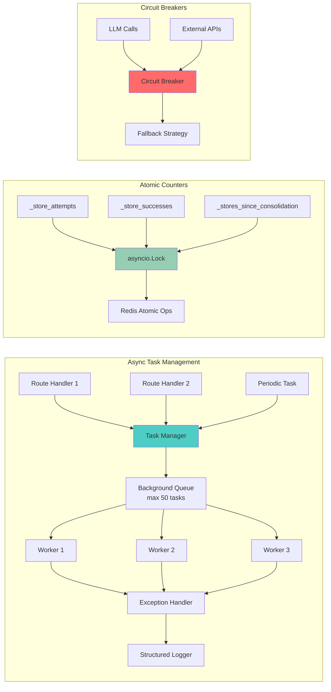
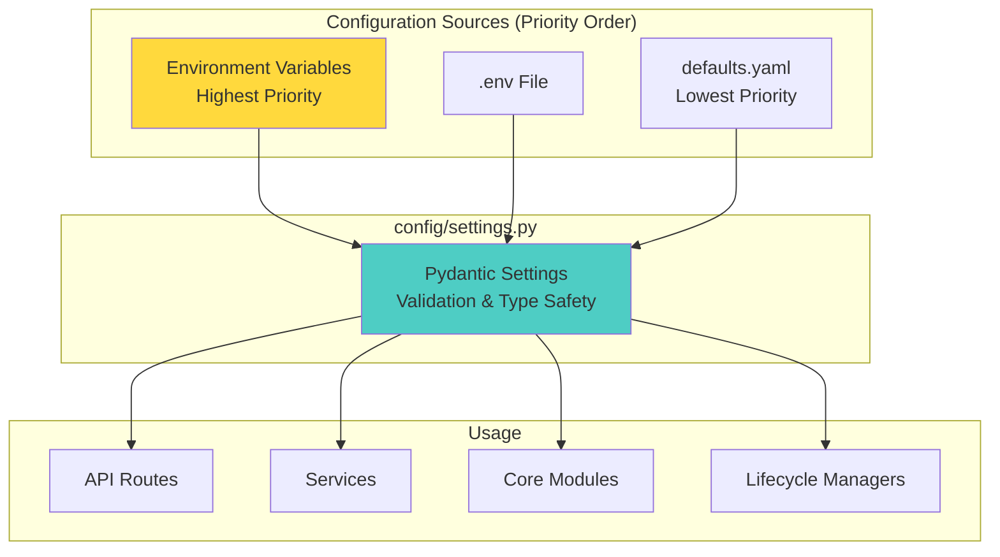
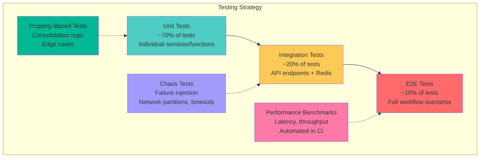
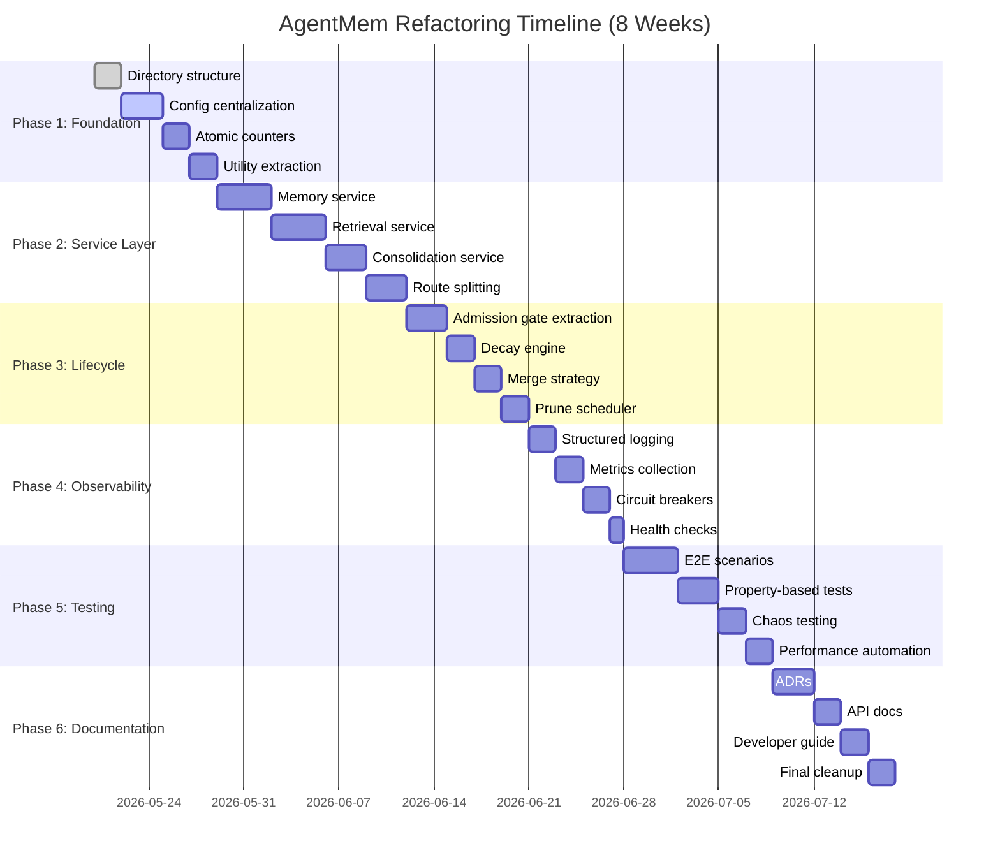
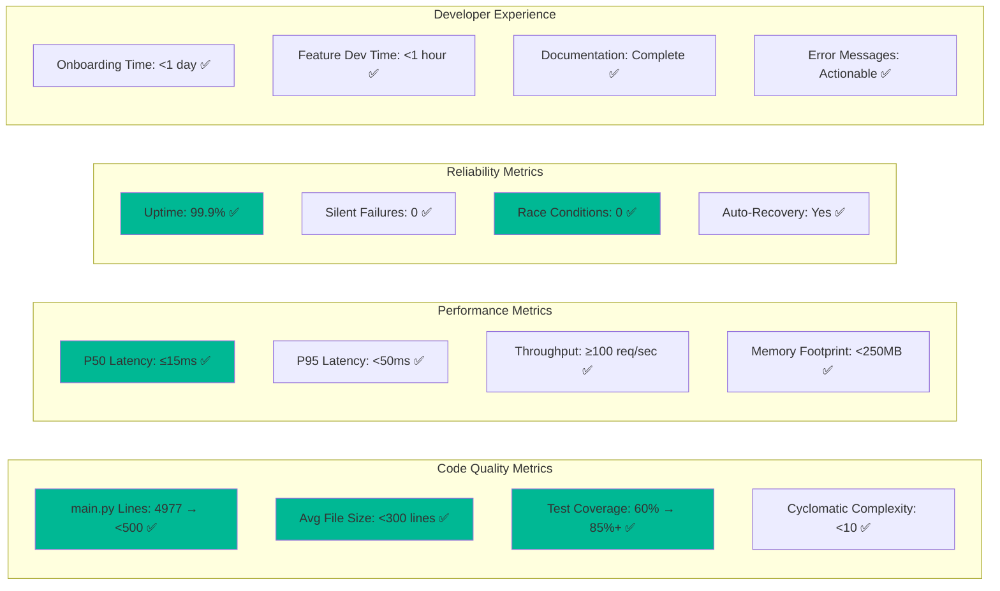

# AgentMem Architecture Diagrams

## Current Architecture (Before Refactoring)



**Problems:**
- 🔴 Everything in one file (high coupling)
- 🟡 Global mutable state (race conditions)
- 🟡 Hardcoded configuration (inflexible)
- ⚪ No clear separation of concerns

---

## Target Architecture (After Refactoring)

```mermaid
graph TB
    subgraph "Client Layer"
        C1[Claude Code]
        C2[LangChain/LangGraph]
        C3[CrewAI/AutoGen]
        C4[MCP Clients]
        C5[Web Dashboard]
    end
    
    subgraph "API Layer (api/)"
        R1[Routes<br/>memory.py, session.py,<br/>capability.py, graph.py]
        M1[Middleware<br/>rate_limit, auth, cors]
        S1[Schemas<br/>request.py, response.py]
        D1[Dependencies<br/>DI container]
    end
    
    subgraph "Service Layer (services/)"
        SV1[Memory Service<br/>CRUD operations]
        SV2[Retrieval Service<br/>Search + Fusion]
        SV3[Consolidation Service<br/>Lifecycle management]
        SV4[Extraction Service<br/>Fact extraction]
        SV5[Context Injection<br/>Token budgeting]
        SV6[Persona Service<br/>User profile]
        SV7[Graph Service<br/>Knowledge graph]
        SV8[Tool Memory Service<br/>Reliability tracking]
    end
    
    subgraph "Lifecycle Layer (lifecycle/)"
        L1[Admission Gate<br/>A-MAC 5-factor]
        L2[Decay Engine<br/>Ebbinghaus curve]
        L3[Merge Strategy<br/>Near-duplicate detection]
        L4[Prune Scheduler<br/>Hard-delete scheduling]
        L5[Evolution Engine<br/>A-MEM enrichment]
    end
    
    subgraph "Core Layer (core/)"
        CO1[Embedder<br/>MiniLM-L12]
        CO2[Extractor<br/>Hybrid regex+LLM]
        CO3[Store<br/>Redis operations]
        CO4[Graph<br/>Entity relationships]
        CO5[Heat<br/>Access frequency]
        CO6[Scene<br/>Language/domain detection]
        CO7[Persona<br/>Profile updates]
        CO8[Summarizer<br/>Session compression]
        CO9[Capability<br/>Tool registry]
        CO10[Retrieval Planner<br/>Query planning]
    end
    
    subgraph "Infrastructure"
        Redis[(Redis 8<br/>HNSW Vectorset)]
        LLM[LLM Provider<br/>Local or Remote]
    end
    
    subgraph "Cross-Cutting Concerns"
        CFG[Config<br/>settings.py]
        CONC[Concurrency<br/>atomic counters,<br/>task manager]
        OBS[Observability<br/>metrics, logging,<br/>health checks]
        UTILS[Utils<br/>text processing,<br/>validation]
        EXC[Exceptions<br/>custom hierarchy]
    end
    
    C1 --> R1
    C2 --> R1
    C3 --> R1
    C4 --> R1
    C5 --> R1
    
    R1 --> D1
    R1 --> M1
    R1 --> S1
    
    D1 --> SV1
    D1 --> SV2
    D1 --> SV3
    D1 --> SV4
    D1 --> SV5
    D1 --> SV6
    D1 --> SV7
    D1 --> SV8
    
    SV1 --> L1
    SV1 --> CO3
    SV2 --> L1
    SV2 --> CO1
    SV2 --> CO4
    SV3 --> L2
    SV3 --> L3
    SV3 --> L4
    SV3 --> L5
    SV4 --> CO2
    SV5 --> CO8
    SV6 --> CO7
    SV7 --> CO4
    SV8 --> CO9
    
    L1 --> CO1
    L2 --> CO3
    L3 --> CO1
    L4 --> CO3
    L5 --> CO1
    
    CO1 --> Redis
    CO2 --> LLM
    CO3 --> Redis
    CO4 --> Redis
    CO9 --> Redis
    
    CFG -.-> R1
    CFG -.-> SV1
    CFG -.-> SV2
    CFG -.-> CO1
    
    CONC -.-> SV1
    CONC -.-> SV3
    
    OBS -.-> R1
    OBS -.-> SV1
    OBS -.-> CO3
    
    UTILS -.-> SV4
    UTILS -.-> SV5
    
    EXC -.-> R1
    EXC -.-> SV1
    
    style R1 fill:#4ecdc4
    style SV1 fill:#45b7d1
    style SV2 fill:#45b7d1
    style SV3 fill:#45b7d1
    style L1 fill:#96ceb4
    style L2 fill:#96ceb4
    style CO1 fill:#feca57
    style CO3 fill:#feca57
    style Redis fill:#ff6b6b
    style CFG fill:#a29bfe
    style CONC fill:#a29bfe
    style OBS fill:#a29bfe
```



**Benefits:**
- ✅ Clear separation of concerns (color-coded layers)
- ✅ Dependency flows downward (no circular dependencies)
- ✅ Each layer independently testable
- ✅ Cross-cutting concerns centralized
- ✅ Easy to extend (add new services without modifying existing code)

---

## Data Flow: Store Operation



---

## Data Flow: Recall Operation



---

## Concurrency Model



---

## Configuration Hierarchy



**Example:**
```python
# config/settings.py
class Settings(BaseSettings):
    auto_consolidate_every: int = Field(default=50, env="AUTO_CONSOLIDATE_EVERY")

# Usage anywhere in codebase
from config.settings import settings

if stores >= settings.auto_consolidate_every:
    await consolidate()
```

**Override via environment:**
```bash
export AUTO_CONSOLIDATE_EVERY=100
python main.py
```

---

## Error Handling Strategy

```mermaid
graph TB
    subgraph "Exception Hierarchy"
        E0[AgentMemError<br/>Base Exception]
        E1[StorageError]
        E2[RetrievalError]
        E3[ConsolidationError]
        E4[ExtractionError]
        E5[ConfigurationError]
        
        E0 --> E1
        E0 --> E2
        E0 --> E3
        E0 --> E4
        E0 --> E5
    end
    
    subgraph "Error Handling Flow"
        H1[Route Handler] --> Try[Try/Except Block]
        Try --> |Success| R1[Return Response]
        Try --> |AgentMemError| H2[Log + HTTP 500]
        Try --> |ValidationError| H3[Log + HTTP 400]
        Try --> |Unexpected| H4[Log + HTTP 500 + Alert]
        
        H2 --> M1[Structured Log<br/>with correlation ID]
        H3 --> M1
        H4 --> M1
        H4 --> A1[Alert System]
    end
    
    subgraph "Retry Policy"
        RP1[Transient Errors] --> Retry[@retry decorator<br/>3 attempts, exponential backoff]
        RP2[Permanent Errors] --> NoRetry[No retry, immediate failure]
        
        Retry --> F1[Fallback Strategy]
    end
    
    style E0 fill:#ff6b6b
    style Try fill:#4ecdc4
    style Retry fill:#96ceb4
```

---

## Testing Pyramid



**Target Coverage:**
- Unit tests: 85%+ line coverage
- Integration tests: All API endpoints
- E2E tests: Critical user journeys (store → consolidate → recall)
- Performance: Automated regression detection
- Chaos: Key failure scenarios tested

---

## Migration Timeline



---

## Success Metrics Dashboard



All metrics tracked via Prometheus + Grafana dashboard (to be implemented in Phase 4).
